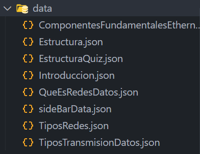
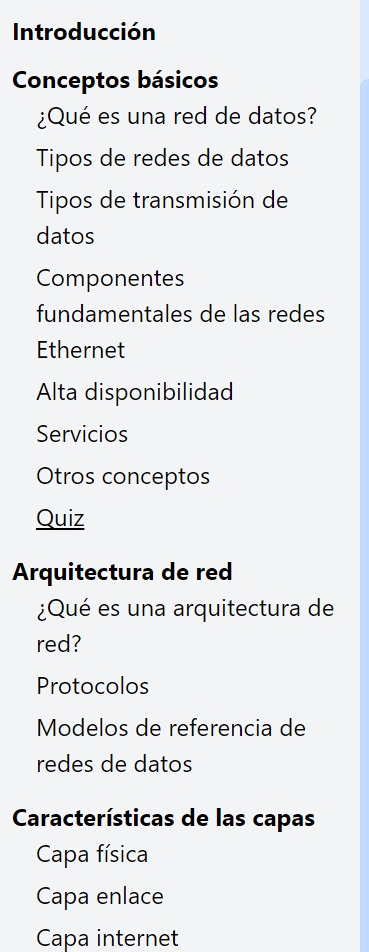
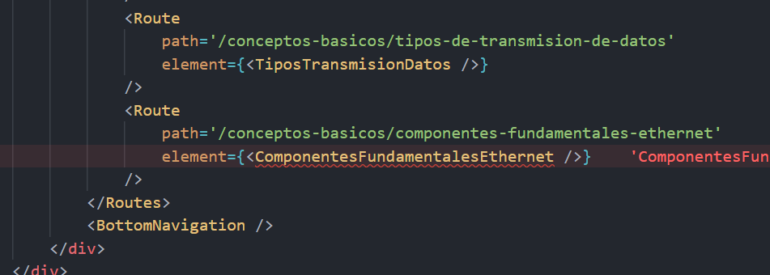
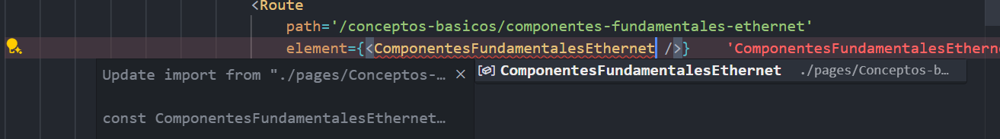

# Guia para redes de datos

### Notas:

- Primero se debe instalar node.js
- La estructura para escribir las temáticas se encuentra en el archivo [Estructura.json](./src/data/Estructura.json)
- La estructura para escribir los quizes se encuentra en el archivo [EstructuraQuiz.json](./src/data/EstructuraQuiz.json)
- Para agregar (los simbolos deben estar pegados a la palabra):
  - Cursiva: Usamos dos asteriscos, uno al inicio de la palabra o frase y otro al final. Ejemplo: _ Cursiva _
  - Negrita: Usamos cuatro asteriscos, dos al inicio de la palabra o frase y otro dos al final. Ejemplo: ** Negrita **
  - Subrayar: Usamos dos guiones bajos, uno al inicio de la palabra o frase y otro al final. Ejemplo: _ Frase subrayada _

## Agregar o editar contenido de una temática en particular

1. Ingresamos a la carpeta _data_ y abrimos el archivo json asociado con la temática que deseamos editar o cambiar:



2. Por ejemplo intentaremos editar información del archivo `Introduccion.json` y editamos directamente la parte que deseamos cambiar o en su defecto añadir. [Introduccion.json](./src/data/Introduccion.json)

## Agregar nuevos módulos o temáticas

Para agregar nuevos módulos o temáticas al proyecto, sigue los siguientes pasos:

1. **Crear un nuevo archivo de módulo**:

   - Navega a la carpeta _pages_ donde agregarás el nuevo módulo.
   - Crea un nuevo archivo con un nombre descriptivo para el módulo dentro de la carpeta nueva que creaste, con la primera letra en mayúscula.

2. **Definir el contenido del módulo**:
   - Abre el archivo recién creado. Allí, colocarás esta plantilla reemplazando con el nombre de tu temática donde diga `NombreDeTuTematica`:
   ```jsx
   import data from '../../data/NombreDeTuTematica.json'
   import ContentRenderer from '../../utils/ContentRenderer'
   export const NombreDeTuTematica = () => {
   	return <ContentRenderer data={data} />
   }
   ```
3. **Actualizar el índice o tabla de contenidos**:

   - Ingresarás al carchivo `sideBarData.json` ubicado dentro de la carpeta _data_, allí añadirás la siguiente estructura.

   ```json
   {
   	"title": "Nombre de tu módulo",
   	"url": "nombre-de-tu-modulo/",
   	"subItems": [
   		{
   			"title": "Titulo de tu primera temática",
   			"url": "/nombre-de-tu-modulo/titulo-primera-tematica"
   		},
   		{
   			"title": "Titulo de tu segunda temática",
   			"url": "/nombre-de-tu-modulo/titulo-segunda-tematica"
   		}
   	]
   }
   ```

   Ejemplo:

   ```json
   {
   	"title": "Características de las capas",
   	"url": "caracteristicas-capas/",
   	"subItems": [
   		{
   			"title": "Capa física",
   			"url": "/caracteristicas-capas/capa-fisica"
   		},
   		{
   			"title": "Capa enlace",
   			"url": "/caracteristicas-capas/capa-enlace"
   		},
   		{
   			"title": "Capa internet",
   			"url": "/caracteristicas-capas/capa-internet"
   		}
   	]
   }
   ```

   El nuevo módulo se ubicaría al final de los modulos previos o en el lugar que usted desee, dependiendo de su posició en el archivo json.

   

4. **Agregar la ruta**:

   - Abrimos el archivo `App.jsx` ubicado en la carpeta _src_, ahí, debajo de alguna ruta, por ejemplo:

   ```jsx
   <Route
   	path='/conceptos-basicos/componentes-fundamentales-ethernet'
   	element={<ComponentesFundamentalesEthernet />}
   />
   ```

   colocamos la siguiente plantilla por cada una de las temáticas que hayamos añadido, asimismo, para el modulo que creamos:

   ```jsx
   <Route
   	path='/nombre-de-tu-modulo/titulo-primera-tematica'
   	element={<NombreDeTuTematica />}
   />
   ```

   Una vez agregaste cada una de las rutas, notarás ciertos errores de importación, allí, colocarás el cursor al final del nombre del modulo o tematica dentro de `element` y presionas Ctrl + espacio para mostrar la importación automática del archivo, finalmente, presionamos _tab_ para que se lleve a cabo la importación.

   

   

5. **Realizar un commit y push**:
   - Guarda los cambios y realiza un commit con un mensaje descriptivo.
   - Realiza un push de los cambios al repositorio remoto para que otros colaboradores puedan acceder al nuevo módulo.

Siguiendo estos pasos, podrás agregar nuevos módulos o temáticas de manera organizada y eficiente.

## Modificar y agregar

1. Ubicamos el archivo de nuestra tematica en la carpeta _data_, allí modificamos las respuestas y preguntas.

- Nota: La estructura para los quizes se encuentra en el archivo json [EstructuraQuiz.json](./src/data/EstructuraQuiz.json), en caso se desee crear un nuevo quiz.

2. Si desearamos crear otro archivo quiz, tendriamos que crear un archivo dentro de la carpeta de nuestro módulo y pegar la siguiente plantilla, modificando donde diga `NombreDelArchivoJsonQuiz` por el nombre de tu archivo y quiz:

```jsx
import QuizRenderer from '../../utils/QuizRenderer'
import data from '../../data/NombreDelArchivoJsonQuiz.json'
export const NombreDelArchivoJsonQuiz = () => {
	return <QuizRenderer quizData={data} />
}
```

3. Luego repetirías el proceso con las rutas como al agregar cualquier otra temática explicada anteriormente.
